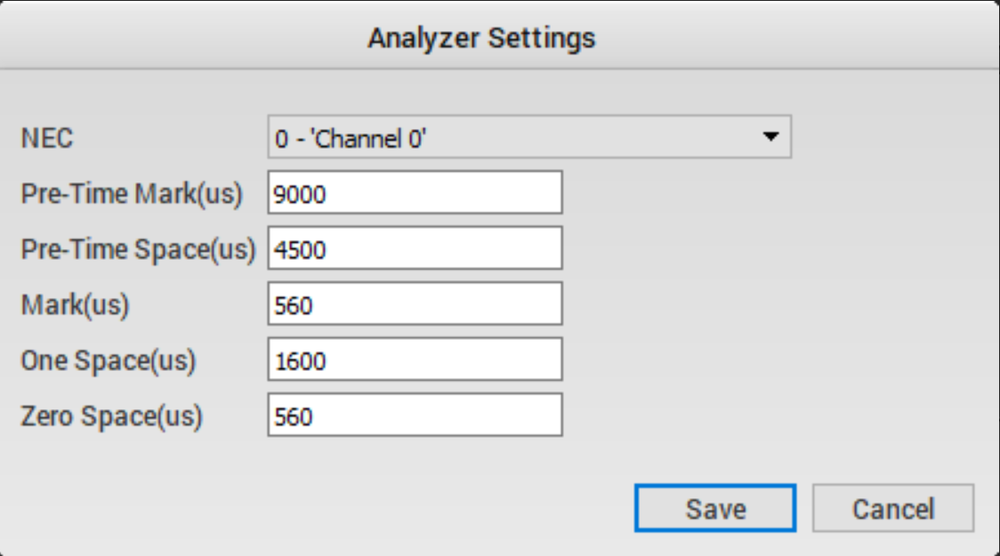

# NEC Analyzer

Saleae Logic Analyzer for the NEC IR-Remote Protocol.

* add protocol to your Salae Logic: 
for x64:  
copy `\Binaries\x64\NECAnalyzer.dll` to `\Program Files\Saleae Inc\Analyzers` 
for x86:  
copy `\Binaries\x86\NECAnalyzer.dll` to `\Program Files\Saleae Inc\Analyzers` 
and restart Salae Logic Software
* changing protocol: 
open MS Visio project `\VisualStudio\NECAnalyzer.sln`

* Saleae: https://www.saleae.com
* Saleae Logic: https://www.saleae.com/downloads
* Analyzer SDK: https://support.saleae.com/saleae-api-and-sdk/protocol-analyzer-sdk

## NEC Protocol Description
Standart NEC protocol consist of preambule (AGC pulse), adress, inverted adress, command and inverted command.

Standart timings are: 
AGC pulse mark - 9ms 
AGC pulse space - 4.5ms 
Bit Mark - 560us 
Space for One - 1.6ms 
Space for Zero - 560us 

But there is many modification of this protocol. Each company change timings for itself. For this reason there is settings for timings of protocol.

Protocol Simulation use standart timings for NEC protocol.

Based on Salae Protocol Analyzer SDK version: 1.2.17

